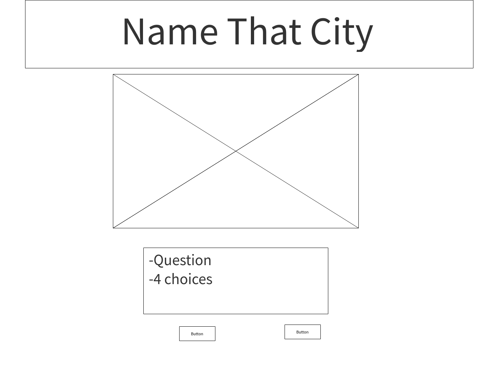

# Name-That-City
Multiple choice game with terrain association representing the questions created with jquery.

## Wireframes: 
Page will be basic multiple choice 8 question layout with photos representing the questions. After the user finishes the questions there will be a congratulation/try again with a restart option regardless of the user outcome.

The photos used where downloaded from google images as follows:

./assets/Page_1.png
./assets/page2.png

## Game Structure: 
Challenges expected to face are primarily design oriented by getting all the photos in marginally uniform and presentable size within the margin frame. Want to incorporate animation in the congratulation/try again page. 

## Phases of Completion: 
Gathering and sizing photos, if/else statements, event listeners, creating buttons with functions and styling.

## Links Cited:

City photos in assets folder
https://learn.jquery.com/ 
https://www.sitepoint.com
https://stackoverflow.com/questions/11828042/add-a-image-with-java-script-to-quiz
https://www.w3schools.com/graphics/game_images.asp
